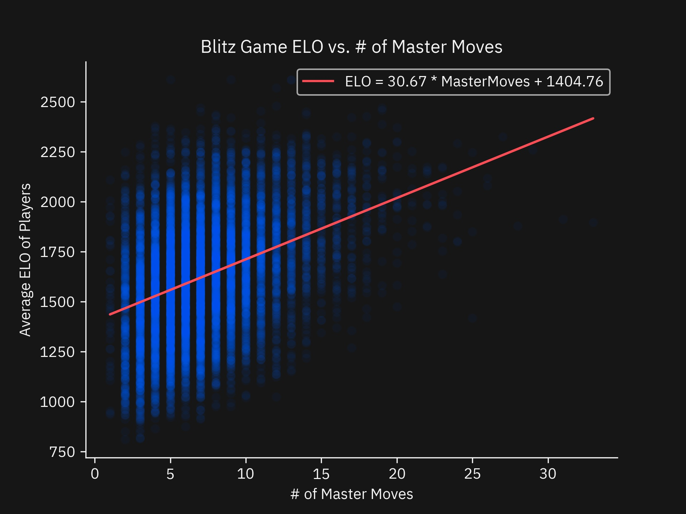

## Introduction
At the start of the pandemic, I picked up a new hobby: Chess. I've become an avid online player in the evenings and puzzle solver in all of my free time. When I'm not having fun with my hobby, I'm studying Statistics and Cognitive Science at the University of Toronto. My courses have introduced me to a plethora of statistical tools that I'm eager to apply to the game. This post is the result of my “Professional Development” assignment for the class STA303, where I am to build/write something to enhance my image as a statistician.

For this project, I will analyze the relationship between knowledge in the opening phase of chess games and rating of players. Many chess players refer to known sequences of moves in the opening as _Opening Theory_ or simply _Theory_. Furthermore, players will refer to a known board position that has been analyzed beforehand as being _In Book_. My initial hypothesis was that players memorize deeper lines of Opening Theory as they progress up the rating ladder to give themselves an advantage when the game transitions to the middlegame. As a player, this felt intuitive because I found myself automatically memorizing moves after checking my games with a Chess Engine and/or searching a database for a similar position. This project will test how long players at every level stay in book using a dataset of public games from Lichess.

**Disclaimer:** I’m not a strong Chess player. And you can verify this by looking at [my Chess.com profile and games](https://www.chess.com/member/adambcomer). That being said, I’m not going to be analyzing individual games or positions in this article. Instead, I’m going to base my analysis on the similarity of play from the Lichess games to an opening book and games played by Masters. 


## Data

For this type of analysis, I need games from players of all rating ranges. [Lichess](https://lichess.org/), a open source Chess server, provides [public datasets of chess games](https://database.lichess.org/#standard_games) played on their site. I used the dataset from April 2017 because it was the smallest dataset with timestamps.

To analyzing openings, I needed an Opening Book to compare with my games. This was a lot harder than I thought it was going to be. Many books are copyedited or only come in physical form. After searching for a few days, I eventually found some [opening books in a nice machine readable format](https://github.com/niklasf/eco).

Initially, I stopped my data collection here. But as did the further analysis, I realized my definition of Opening Theory was extremely limited. Most, if not all, strong players prepare opening lines that extend far beyond the 4-6 moves in a standard opening book. In the recent Opera Euro Rapid Finals, [Wesley So attributes his loss in round 2 to not looking at the move 21. Qxe4](https://www.chess.com/news/view/opera-euro-rapid-chess-finals-day-1). I wanted to look deeper into these online games and see how players at every level are copying these Masters. To do this, I used a [dataset of Master Level games](https://rebel13.nl/download/data.html) to check for similarities.

Due to the limits of my laptop's hardware, I used the first 200,000 master games to construct a [Trie](https://en.wikipedia.org/wiki/Trie) of all of the moves. Effectivity, I was treating the search of opening moves as substring search. This tree of games and their moves is referred to as the Master Game Index.

To build a DataFrame, I extracted the first 20,000 Blitz and Bullet games from the Lichess Dataset and counted the number of moves that matched the Opening Book and the Master Game Index. I took the header information from the games, fields such as player rating or time format, and made them into columns. A small preview can be found below.

**Aside:** This project involved a lot more Data Engineering then I anticipated. As a student, I seldomly come across projects that force you efficiently index and search these large dataset. If you teach a 300+ level statistics class, I recommend giving an assignment that has a Data Engineering section of non-table like data. Many useful datasets not formatted as tables for statisticians. And teaching students how to process, index, and format these data sources will help them in their future careers.

```python
games = pd.read_csv('data/games.csv', index_col='ID', delimiter=',')
games.head()
```

```
                             GameType          White  WhiteElo  WhiteRatingDiff         Black  BlackElo  BlackRatingDiff Result                                            Opening  ECO TimeControl  OpeningMoves  MasterMoves
ID                                                                                                                                                                                                                            
https://lichess.org/tGpzk7yJ    Blitz   calvinmaster      2186                4  dislikechess      1907               -4    1-0          King's Gambit Accepted: Schallopp Defense  C34       180+0             6            8
https://lichess.org/LzvBtZ93   Bullet    Gregster101      1385               10     flavietta      1339               -9    1-0       King's Gambit Accepted: King's Knight Gambit  C34       120+1             5            9
https://lichess.org/TR5upkT0    Blitz          Napen      1905                8       Volcoom      1836               -9    1-0  Ruy Lopez: Schliemann Defense, Schoenemann Attack  C63       180+0             7           18
https://lichess.org/UHBSjQt4   Bullet   bRoCk-LeSnAr      1670              -21        czarny      1812                6    0-1                                  Hungarian Opening  A00       120+1             1            1
https://lichess.org/Qh8ynBVM    Blitz  farhad_karaji       988               -7     micro-dog      1145                7    0-1                               Van't Kruijs Opening  A00       180+0             1            5

[20000 rows x 12 columns]
```


## Analysis

This sections is split into two parts for the two most popular formats of chess online: Blitz and Bullet Chess. Blitz Chess games usually allocate 3 or 5 minutes per player and Bullet Chess games usually allocate 1 or 2 minutes per player. All steps of the analysis are repeated for both game types.

### Blitz

First, the games are filtered to only Blitz matches. This leaves 13,150 games in the dataset.

```python
# 13150 Games remaining
blitz_games = games[games['GameType'] == 'Blitz']
```

Next, the distribution of games needs to be checked. Ideally, the players ratings should be representative of the population, which has a nice bell-shaped curve.


```python
fig, ax = plot.subplots()
plot.hist(blitz_games['WhiteElo'], bins=50, color='#0062ff')

plot.title('Blitz ELO with White')
ax.set_xlabel('Player ELO')
ax.set_ylabel('Games')

plot.show()
```


For the player with the white pieces, this sample of games looks representative.

```python
fig, ax = plot.subplots()
plot.hist(blitz_games['BlackElo'], bins=50, color='#0062ff')

plot.title('Blitz ELO with Black')
ax.set_xlabel('Player ELO')
ax.set_ylabel('Games')

plot.show()
```


Again, for the player with the black pieces, this sample of games looks representative.

Next, the games should be balanced. That is, the ratings between the players should be similar. Games where the difference is too large will guarantee one side will win, potentially biasing downstream analysis. 

```python
fig, ax = plot.subplots()
plot.hist(blitz_games['WhiteElo'] - blitz_games['BlackElo'], bins=50, color='#0062ff')

plot.title('Blitz ELO Difference')
ax.set_xlabel('ELO Difference')
ax.set_ylabel('Games')

plot.show()
```


Most of the games fall in the fair range of ±200 rating points. There are a few outliers bleeding into the ±500 point range.


```python
# 11562 Games remaining
blitz_games = blitz_games[abs(blitz_games['WhiteElo'] - blitz_games['BlackElo']) < 200]
```

After clearing out the games with a wide rating difference, there are 11,562 games remaining in this dataset.

Next, to get a better understanding of the number of Book Moves featured in the dataset, a simple distribution of the counts will suffice.

```python
agg = blitz_games.groupby(['OpeningMoves']).agg(['count'])

fig, ax = plot.subplots()
plot.bar(agg.index, agg[('Opening', 'count')], color='#0062ff')

plot.title('Blitz Games # of Book Moves')
ax.set_xlabel('# of Book Moves')
ax.set_ylabel('Games')

plot.show()
```


Grouping by the number of Book Moves featured, a nice gradually descending distribution is apparent. Clearly, the majority of games have 2-6 Book Moves played.

Next, I made a simple regression to quantify the relationship between the rating of the players and the number of Book Moves featured in a game.

```python
blitz_games['ELOAverage'] = (blitz_games['WhiteElo'] + blitz_games['BlackElo']) / 2

res = stats.linregress(blitz_games['OpeningMoves'], blitz_games['ELOAverage'])
```
```
Regression Results:
  slope: 12.878527255330097
  intercept: 1576.655656676459, 
  rvalue: 0.08137428579792201, 
  pvalue: 1.8927751604955526e-18, 
  stderr: 1.4670922151454777, 
  intercept_stderr: 5.938045602789431
```

```python
fig, ax = plot.subplots()
plot.title('Blitz Game ELO vs. # of Book Moves')
ax.set_xlabel('# of Book Moves')
ax.set_ylabel('Average ELO of Players')

plot.scatter(blitz_games['OpeningMoves'], blitz_games['ELOAverage'], alpha=0.05, color='#0062ff')
plot.plot(blitz_games['OpeningMoves'], res.intercept + res.slope * blitz_games['OpeningMoves'], color='#fa4d56', 
          label=f'ELO = {round(res.slope, 2)} * BookMoves + {round(res.intercept, 2)}')

plot.show()
```


Looking at our regression, there is a slight positive relationship that is significant (p < 0.05) but has a small R^2 of 0.00662. I expected the variance to be high but not this high.

The first version of my analysis stopped here. After sitting on it for a few days, I realized that players don’t stop memorizing lines when the Encyclopedia of Chess Openings line ends, they often follow a game played by Masters before entering a novelty. After adding this extra field, I made a second regression of the player ratings and the number of moves followe from a Master game. 

```python
fig, ax = plot.subplots()
plot.bar(agg.index, agg[('Opening', 'count')], color='#0062ff')

plot.title('Blitz Games # of Master Moves')
ax.set_xlabel('# of Book Moves')
ax.set_ylabel('Games')

plot.show()
```


Comparing this bar chart with the previous, players are sticking to Master games for longer than Book Moves alone. This gives us good evidence that _Opening Theory_ consists of more than a 2-6 move Opening Book.

```python
res = stats.linregress(blitz_games['MasterMoves'], blitz_games['ELOAverage'])
```
```
Regression Results:
  slope: 30.674892863592703
  intercept: 1404.7621823835452
  rvalue: 0.37307786524629527
  pvalue: 0.0
  stderr: 0.7095108471201739
  intercept_stderr: 5.61993939067637
```

```python
fig, ax = plot.subplots()
plot.title('Blitz Game ELO vs. # of Master Moves')
ax.set_xlabel('# of Master Moves')
ax.set_ylabel('Average ELO of Players')

plot.scatter(blitz_games['MasterMoves'], blitz_games['ELOAverage'], alpha=0.05, color='#0062ff')
plot.plot(blitz_games['MasterMoves'], res.intercept + res.slope * blitz_games['MasterMoves'], color='#fa4d56', 
          label=f'ELO = {round(res.slope, 2)} * MasterMoves + {round(res.intercept, 2)}')

plot.show()
```


Looking at our second regression, there is a positive relationship that is significant (p < 0.05) but has a modest R^2 of 0.13919. This was the relationship I hypothesized in the introduction. 

### Bullet

For the Bullet section, I did the same analysis but the graphs and conclusions were essentially identical to the Blitz section. I included the graphs in the Appendix for completeness.

First, the games are filtered to Bullet format and the games with less than a ±200 rating differential.

```python
# 6850 Games remaining
bullet_games = games[games['GameType'] == 'Bullet']
# 5555 Games remaining
bullet_games = bullet_games[abs(bullet_games['WhiteElo'] - bullet_games['BlackElo']) < 200]
```

Next, I will do the same regressions in the Blitz Section.

```python
bullet_games['ELOAverage'] = (bullet_games['WhiteElo'] + bullet_games['BlackElo']) / 2

res = stats.linregress(bullet_games['OpeningMoves'], bullet_games['ELOAverage'])
```
```
Regression Results:
  slope: -18.938642094441818
  intercept: 1746.6965926816904
  rvalue: -0.11197971306496589
  pvalue: 5.736604103545491e-17
  stderr: 2.255306260261277
  intercept_stderr: 7.668411448527872
```

```python
fig, ax = plot.subplots()
plot.title('Bullet Game ELO vs. # of Book Moves')
ax.set_xlabel('# of Book Moves')
ax.set_ylabel('Average ELO of Players')

plot.scatter(bullet_games['OpeningMoves'], bullet_games['ELOAverage'], alpha=0.05, color='#0062ff')
plot.plot(bullet_games['OpeningMoves'], res.intercept + res.slope * bullet_games['OpeningMoves'], color='#fa4d56', 
          label=f'ELO = {round(res.slope, 2)} * BookMoves + {round(res.intercept, 2)}')

plot.show()
```


Initially, this regression and graph caught me off guard. Why would playing fewer book moves correlate with a higher rating? To verify this this relationship, I did a second regression of player rating and Master moves.


```python
res = stats.linregress(bullet_games['MasterMoves'], bullet_games['ELOAverage'])
```
```
Regression Results:
  slope: 8.206545855725649
  intercept: 1639.3828293657148
  rvalue: 0.09319956154540714
  pvalue: 3.4044901651001904e-12
  stderr: 1.1764901073637415
  intercept_stderr: 8.150519297257242
```

```python
fig, ax = plot.subplots()
plot.title('Blitz Game ELO vs. # of Master Moves')
ax.set_xlabel('# of Master Moves')
ax.set_ylabel('Average ELO of Players')

plot.scatter(bullet_games['MasterMoves'], bullet_games['ELOAverage'], alpha=0.05, color='#0062ff')
plot.plot(bullet_games['MasterMoves'], res.intercept + res.slope * bullet_games['MasterMoves'], color='#fa4d56', 
          label=f'ELO = {round(res.slope, 2)} * MasterMoves + {round(res.intercept, 2)}')

plot.show()
```


When looking at the number of master moves played and player rating, the relationship is greatly diminished compared to the Blitz section. This confirms the trend in the prior regression. 

To a non-chess player this relationship might be very unexpected. If opening moves are typically memorized, why are players not playing Book moves or Master moves just like in blitz? In the Discussion section, I will explore this finding more.

## Discussion

In the Analysis, I looked at relationship of moves played from an Opening Book and Master Games and player rating for Blitz and Bullet time formats. I verified that player ratings were representative and normally distributed, matching what I expected. Additionally, I verified that there was a downward trend of Book and Master moves featured past the limited set of first moves, as expected. 

In the Blitz regression analysis, a weak positive relationship between the number of Book moves and rating was present. And a strong positive relationship existed between the number of Master moves and rating. There are two possible ways to interpret this result. 

1. Strong players can generally find the top moves that Masters play. 
2. Strong players are using moves from a database of Master games to improve. 

There is probably a mix of both going here. Good moves are objectively good in perfect information game like Chess and players are looking at what others are doing to improve their game. 

In the Bullet regression analysis, a weak negative negative relationship between the number of Book moves and rating was present. And a weak positive relationship existed between the number of Master moves and rating. This was an unexpected result. Many online chess players will tell you that Bullet Chess is a fundamentally different game than Blitz Chess. Many games are won or lost on time, not checkmate. This favors the player who can play faster, not better. To increase the amount of time your opponent consumes per move, players try to complicate the position and throw unusual moves at their opponent. 

In the recent [IM not a GM tournament](https://www.chess.com/article/view/2021-im-not-a-gm-speed-chess-championship), [International Master(IM) Levy Rozman recounts his opening preparation for the bullet section consisted of the unusual move 1.b3](https://youtu.be/C3QlcE55VUo?t=794), featured below. 

<div style='width:50%;margin:auto;'>


</div>

In the [Chess.com Move Database](https://www.chess.com/explorer), 1.b3 is the 6th most common first move with 12,327 of 2,785,695 games or 0.44% of the games. IM Rozman argues his move was a tactic to confuse his opponent in the Bullet section. And could plausibly be the reason he made it to the final.

The lack of time means an opponent doesn’t have time to think about how a strange move might affect the position long term, they need to keep moving just to not lose on time. The data is revealing this common understanding of the time control. Players are playing sub-optimal moves designed to make their opponent think and put them into time trouble.

## Conclusion

Overall, I analyzed 20,000 Lichess Bullet and Blitz games to compare opening knowledge and player rating. In the Blitz section, my hypothesized positive relationship of Book and Master moves compared to player rating was found. In the Bullet section, my analysis found the opposite relationship with Book moves and a small positive relationship with Master moves. In the Discussion section, I brought in an analysis from a professional Blitz and Bullet tournament player, IM Levy Rozman, to show how throwing odd moves at your opponent can cause them to burn time on their clock for a winning time advantage. For me, this whole project is good motivation to study the Master games from a Chess Book I recently picked up.

## Appendix

All resources used to create this dataset and analysis.

### Datasets
- [Lichess Games](https://database.lichess.org/#standard_games)
- [Master Games](https://rebel13.nl/download/data.html)
- [Opening Book](https://github.com/niklasf/eco)

### Master Game Index Builder

```python
import pickle
import chess.pgn


def main(pgn):
    move_idx = {}

    counter = 0
    while True:
        game = chess.pgn.read_game(pgn)
        if game is None:
            break
        counter += 1

        pos = move_idx
        for m in game.mainline_moves():
            m = m.uci()
            if m in pos:
                pos = pos[m]
            else:
                pos[m] = {}
                pos = pos[m]

        if counter == 200000:
            break

    with open('data/master_game_index.pickle', 'wb') as handle:
        pickle.dump(move_idx, handle)


if __name__ == '__main__':
    pgn = open('data/mb-3.45.pgn', encoding='ISO-8859-1')
    main(pgn)
```

### Dataset Builder

```python
import pickle
from typing import Dict

import chess.pgn
import chess.polyglot
from chess.pgn import Game
import pandas as pd


def get_book():
    a_eco = pd.read_csv('data/a.tsv', index_col='moves', delimiter='\t')
    b_eco = pd.read_csv('data/b.tsv', index_col='moves', delimiter='\t')
    c_eco = pd.read_csv('data/c.tsv', index_col='moves', delimiter='\t')
    d_eco = pd.read_csv('data/d.tsv', index_col='moves', delimiter='\t')
    e_eco = pd.read_csv('data/e.tsv', index_col='moves', delimiter='\t')

    return pd.concat([a_eco, b_eco, c_eco, d_eco, e_eco])


def get_master_move_index():
    index_file = open('data/master_game_index.pickle', 'rb')
    idx = pickle.load(index_file)
    index_file.close()

    return idx


def read_games():
    book = get_book()
    master_move_idx = get_master_move_index()
    counter = 0

    pgn = open('data/lichess_db_standard_rated_2017-04.pgn')

    games = []
    while True:
        offset = pgn.tell()
        headers = chess.pgn.read_headers(pgn)
        if headers is None:
            break

        if headers['Event'] != 'Rated Blitz game' and headers['Event'] != 'Rated Bullet game':
            chess.pgn.skip_game(pgn)
            continue
        if 'WhiteElo' not in headers or 'BlackElo' not in headers:
            chess.pgn.skip_game(pgn)
            continue
        if 'WhiteRatingDiff' not in headers or 'BlackRatingDiff' not in headers:
            chess.pgn.skip_game(pgn)
            continue

        pgn.seek(offset)
        game = chess.pgn.read_game(pgn)

        game = process_game(book, master_move_idx, game)
        if game is None:
            continue

        if counter == 20000:
            break

        games.append(game)
        counter += 1

    return games


def process_game(book: pd.DataFrame, master_move_idx: Dict[str, Dict], game: Game):
    opening = None
    moves = []

    moves_key = ''
    for m in game.mainline_moves():
        moves_key += m.uci()

        if moves_key in book.index:
            opening = book.loc[moves_key]['name']
            moves = moves_key
        else:
            break
        moves_key += ' '

    master_moves = 0
    pos = master_move_idx
    for m in game.mainline_moves():
        m = m.uci()
        if m in pos:
            master_moves += 1
            pos = pos[m]
        else:
            break

    if opening is None:
        print(f'Skipped: {game.headers["Opening"]}')
        return None

    return [
        game.headers['Site'],
        'Bullet' if game.headers['Event'] == 'Rated Bullet game' else 'Blitz',
        game.headers['White'],
        game.headers['WhiteElo'],
        game.headers['WhiteRatingDiff'],
        game.headers['Black'],
        game.headers['BlackElo'],
        game.headers['BlackRatingDiff'],
        game.headers['Result'],
        opening,
        game.headers['ECO'],
        game.headers['TimeControl'],
        len(moves.split(' ')),
        master_moves
    ]


if __name__ == '__main__':
    games = read_games()

    games = pd.DataFrame(games, columns=['ID', 'GameType', 'White', 'WhiteElo', 'WhiteRatingDiff', 'Black', 'BlackElo', 'BlackRatingDiff', 'Result', 'Opening', 'ECO', 'TimeControl', 'OpeningMoves', 'MasterMoves'])
    games = games.set_index('ID')
    games.to_csv('data/games.csv')

```

### Graphs

#### Blitz
- [Histogram of ELO with the White Pieces](/assets/img/chess-analysis/BlitzWhiteElo.jpeg)
- [Histogram of ELO with the Black Pieces](/assets/img/chess-analysis/BlitzBlackElo.jpeg)
- [Histogram of of the ELO Difference between the Players](/assets/img/chess-analysis/BlitzPlayerDifference.jpeg)
- [Bar graph of the number of games played grouped by the number of Book moves featured](/assets/img/chess-analysis/BlitzBookMoves.jpeg)
- [Bar graph of the number of games played grouped by the number of Master moves featured](/assets/img/chess-analysis/BlitzMasterMoves.jpeg)
- [Scatter plot of Average Player ELO vs number of Book moves featured](/assets/img/chess-analysis/BlitzBookMovesElo.jpeg)
- [Scatter plot of Average Player ELO vs number of Master moves featured](/assets/img/chess-analysis/BlitzMasterMovesElo.jpeg)

#### Bullet
- [Histogram of ELO with the White Pieces](/assets/img/chess-analysis/BulletWhiteElo.jpeg)
- [Histogram of ELO with the Black Pieces](/assets/img/chess-analysis/BulletBlackElo.jpeg)
- [Histogram of of the ELO Difference between the Players](/assets/img/chess-analysis/BulletPlayerDifference.jpeg)
- [Bar graph of the number of games played grouped by the number of Book moves featured](/assets/img/chess-analysis/BulletBookMoves.jpeg)
- [Bar graph of the number of games played grouped by the number of Master moves featured](/assets/img/chess-analysis/BulletMasterMoves.jpeg)
- [Scatter plot of Average Player ELO vs number of Book moves featured](/assets/img/chess-analysis/BulletBookMovesElo.jpeg)
- [Scatter plot of Average Player ELO vs number of Master moves featured](/assets/img/chess-analysis/BulletMasterMovesElo.jpeg)